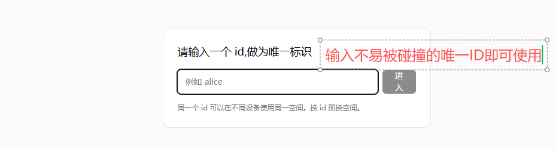
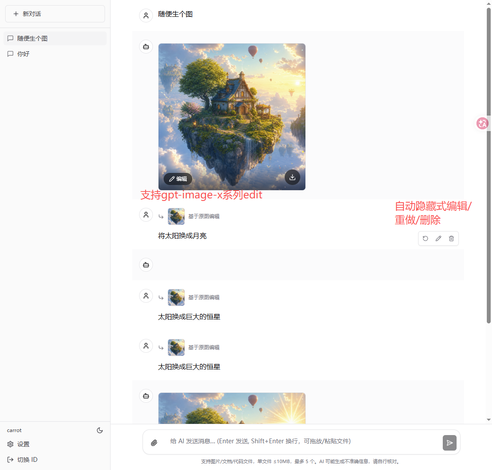
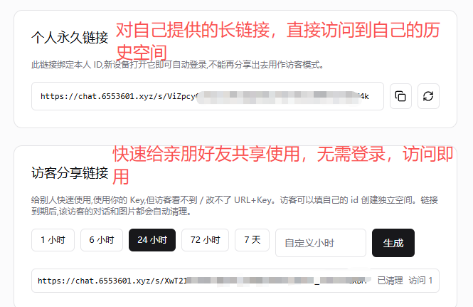
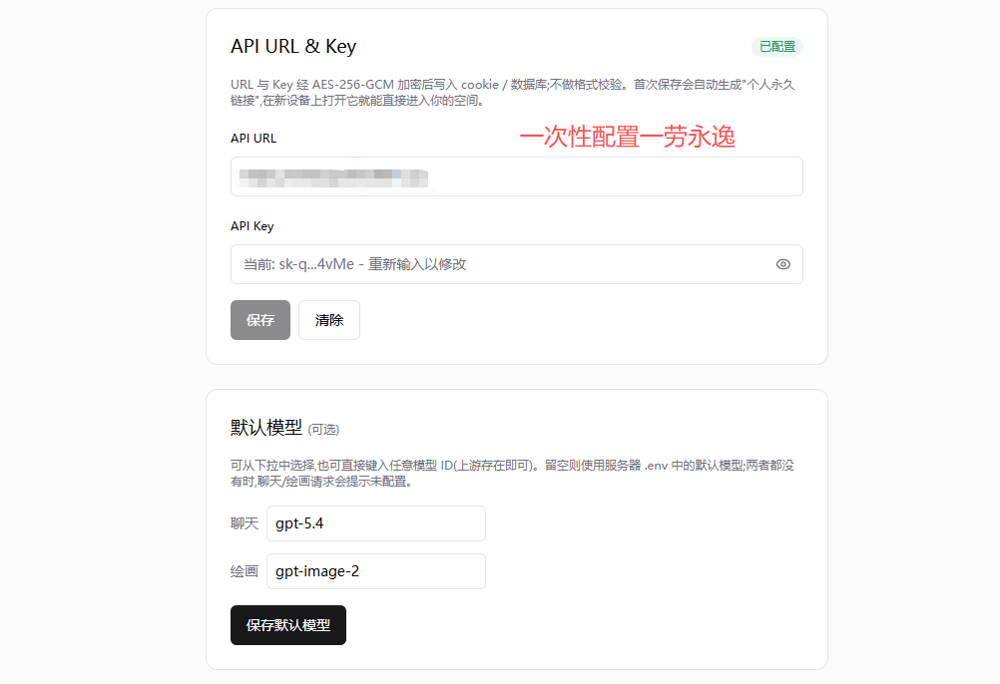

# aichat-web-oss

无登录、可分享、自清理的多租户 ChatGPT 风格聚合 AI 前端。把任意 OpenAI 兼容上游(OpenAI 官方 / new-api / LiteLLM / 自建中转 / CLIProxyAPI 等)变成一个开箱即用的对话 + 绘画 Web 端。

---

## 功能

- **零登录**:输入一个自定义 ID 即建立独立空间,无密码、无第三方 OAuth、服务端无 `User` 表
- **自配置上游**:`/settings` 直接填 base URL + API Key + 默认模型,经 AES-256-GCM 加密写入 cookie,不校验 `sk-` 前缀
- **永久 owner 链接**:首次保存配置后自动生成,新设备打开即自动登录,等价于跨设备同步
- **限时 guest 分享**:可签发 1–8760 小时的访客链接;访客看不到也改不了 URL/Key,但共享上游配额
- **命名空间隔离**:guest 接收方 ID 自动变成 `s:<shareId>:<raw>`,DB 与文件系统全部按字符串隔离
- **自动清理**:guest 链接到期/撤销 → 后台 sweep(默认 60s 一次)自动删该命名空间下所有会话/消息/落盘图片
- **文本对话**:Vercel AI SDK v4 `streamText`,Markdown + GFM + 代码高亮 + KaTeX 数学公式
- **多模态上传**:拖放 / 粘贴 / 选择器,单文件 ≤ 10 MB,最多 5 个;图片走 Vision、文档走 OpenAI `file`、纯文本内联 TextPart
- **绘画**:`generate_image` / `edit_image` 两个工具,LLM 自行判定意图;支持 1024x1024 / 1536x1024 / 1024x1536 / auto、quality、透明背景、png/jpeg/webp、n=1–4
- **ChatGPT 风格图片编辑**:点助手图片右下角「编辑」→ 输入指令 → 自动注入 `Original image URL:` 触发 `edit_image` 工具
- **消息工具栏**:每条消息 hover 显示「重新生成 / 编辑 / 删除」,可改写历史上下文
- **生图心跳**:生图期间每秒平滑显示「正在生图 Xs」气泡,避免长时间空白等待

---

## 截图

| | |
|---|---|
|  |  |
|  |  |

---

## 技术栈

| 层 | 选型 |
|---|---|
| 框架 | Next.js 15 App Router + TypeScript + Tailwind |
| UI | shadcn/ui (Radix) + lucide-react |
| AI | Vercel AI SDK v4 (`ai` + `@ai-sdk/openai`);`streamText` + `StreamData` + `tool()` |
| 身份 | 自定义 cookie(无 Auth.js / 无密码) |
| 加密 | AES-256-GCM(64 hex 密钥),同时加密 cookie payload 与 `ShareLink` 表中的 URL/Key |
| DB | PostgreSQL 16 + Prisma(`Conversation` / `Message` / `ShareLink`,无 `User` 表) |
| Markdown | react-markdown + remark-gfm + rehype-highlight + KaTeX |
| 部署 | Docker 多阶段 standalone + docker-compose |

---

## 本地开发

```bash
cp .env.example .env.local
# 编辑 .env.local,重点填:
#   ENCRYPTION_KEY  (openssl rand -hex 32)
#   DATABASE_URL    (本机连 docker-compose.dev.yml 中的 postgres)

docker compose -f docker-compose.dev.yml up -d   # 起 postgres
npm install
npx prisma migrate dev                            # 首次建表
npm run dev                                       # http://localhost:3000
```

进站第一步会被 `IdentityGate` 拦下:输入任意 id(1–32 字符,字母/数字/下划线/连字符/点号/空格),随后到 `/settings` 填上游配置。

---

## 生产部署 (Docker)

```bash
# 1. 准备 .env(字段同 .env.example)
#    必填: ENCRYPTION_KEY (openssl rand -hex 32)
#         POSTGRES_USER / POSTGRES_PASSWORD / POSTGRES_DB
#    可选: APP_PORT (默认 3081)
#         DEFAULT_CHAT_MODEL / DEFAULT_IMAGE_MODEL
#         SHARE_SWEEP_INTERVAL_SEC (默认 60)

# 2. 准备绑定卷目录(uid/gid 必须与容器内 nextjs 用户一致)
mkdir -p public/generated logs
chown -R 1001:1001 public/generated logs

# 3. 启动
docker compose build
docker compose up -d
docker compose logs -f app
```

健康检查:`curl -fsS http://127.0.0.1:${APP_PORT:-3081}/api/self` → 200。

> ⚠️ `chown 1001:1001` 必须做。否则 `persistImages()` 写不进绑定卷,会静默 fallback 把 base64 直接落进 DB,单条消息可能膨胀到几 MB。

---

## 关键 API 路由

| 路由 | 方法 | 用途 |
|---|---|---|
| `/api/self` | GET | 当前 userId / 是否已配置 / 分享元信息 |
| `/api/identity` | POST / DELETE | 设置 / 清除 user_id cookie |
| `/api/config` | GET / PUT / DELETE | 读取脱敏配置 / 保存(自动建 owner 链接) / 清空 |
| `/api/share` | GET / POST | 列出 owner+guests / 签发 guest 链接 |
| `/api/share/[id]` | DELETE | 撤销(owner 自动新建;guest 触发清理) |
| `/api/chat` | POST | streamText + buildImageTools |
| `/api/messages/[id]` | PATCH / DELETE | 编辑 / 删除单条;`?cascade=after\|descendants` 用于重新生成 |
| `/api/conversations*` | CRUD | 会话与消息(强制按 `userId` 过滤) |
| `/api/models` | GET | 透传 `${baseUrl}/v1/models` |
| `/api/upload-image` | POST | data URL 持久化到 `public/generated/<seg>/`(图片编辑兜底) |
| `/s/[id]` | GET | 分享入口:owner→`/`,guest→`/s/[id]/enter` |
| `/generated/[...path]` | GET | 运行时落盘图片读取(绕过 standalone 静态缓存) |

---

## 数据卷

| 宿主路径 | 容器内 | 用途 |
|---|---|---|
| `aichat_oss_pgdata`(named volume) | `/var/lib/postgresql/data` | Postgres 数据 |
| `./logs` | `/app/logs` | 应用 JSON 日志(每日切分) |
| `./public/generated` | `/app/public/generated` | 生图产物 |

升级时只重建 app 容器,**不要**删 `aichat_oss_pgdata` 与 `public/generated/`。备份建议:

```bash
docker compose exec postgres pg_dump -U $POSTGRES_USER $POSTGRES_DB > backup_$(date +%Y%m%d).sql
tar -czf images_$(date +%Y%m%d).tgz public/generated
```

---

## 安全说明

- ID 即身份认证密钥:任何人输入相同 ID 都进入同一空间,**不可作机密身份使用**
- URL/Key 经 AES-256-GCM 加密落 cookie + ShareLink 表;`ENCRYPTION_KEY` 丢失等于全部数据无法解密
- guest 视图严格脱敏:看不到 URL/Key/模型字段,只看到「该链接有效期至 X」
- `/generated/[...path]` 当前是「持有完整 URL 即可访问」模式,适合公开部署;若需更强隔离可自行加 cookie 校验

---

## License

MIT
